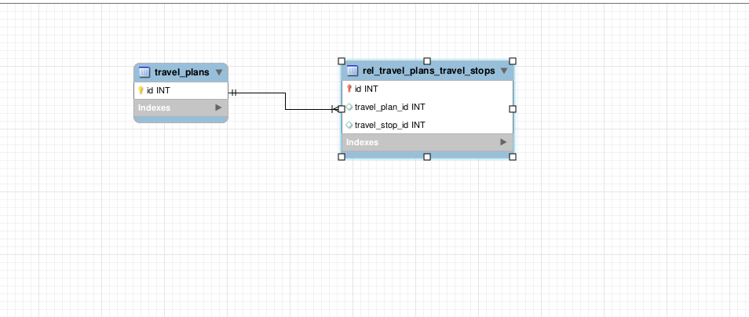

# rick-and-morty-api

API build for a Code Challenge from a job posting. It uses
[crystal](https://crystal-lang.org/), a programming language with ruby-like sintax
and performance close to C.

# Travel Plans API

This API allows you to manage travel plans. The following endpoints are available:

## Endpoints

### `GET /travel_plans`

Retrieves a list of all travel plans.

### `GET /travel_plans/:id`

Retrieves a specific travel plan. You can provide the following options as query parameters:

- `optimise=true`: Optimises the travel stops according to the following rules:
  1. Every stop from the same dimension must be grouped.
  2. Inside a same dimension, the stops must be ordered in ascending order of popularity.
  3. If the popularity is the same, then order by name.
  4. The order of visit of the dimensions is defined by the average of their total populations.

- `expand=true`: Brings information on travel stop name, dimension, and type.

### `POST /travel_plans`

Creates a new travel plan.

### `PUT /travel_plans/:id`

Updates a specific travel plan.

### `DELETE /travel_plans/:id`

Deletes a specific travel plan.

## DB

The project uses a MySQL database, with [Jennifer](https://github.com/imdrasil/jennifer.cr) as ORM

## Installation

Check main README.md

## Usage

Check main README.md

## Development

Check main README.md

## Contributors

- #### Alan Galvão Martini
  1. [Linkedin](https://www.linkedin.com/in/alangmartini/)
  2. [Github](https://github.com/alangmartini/)
  3. [Email](gmartinialan@gmail.com)
